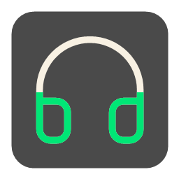

# Headset Battery

  

[English](README.md)

**Headset Battery** — компактное portable-приложение для Windows, работающее только в системном трее. Оно показывает состояние активного устройства вывода звука и, когда это возможно, уровень заряда подключённых Bluetooth-наушников или гарнитур.

Установка не требуется: достаточно распаковать архив релиза и запустить `HeadsetBattery.exe` из любой папки. Настройки и необязательный автозапуск сохраняются для текущего пользователя.

## Возможности

- Определяет текущее устройство вывода Windows: динамики, Bluetooth-наушники или гарнитуру в режиме Hands-Free.
- Показывает соответствующий глиф в трее. Для наушников и гарнитуры заряд отображается заполнением глифа: зелёным при нормальном уровне и красным при уровне 30% или ниже.
- По желанию вместо заполнения показывает точный процент в цветной плашке. Переключатель находится в меню настроек.
- В контекстном меню выводит все обнаруженные подключённые Bluetooth-аудиоустройства, их заряд и отметку у текущего устройства.
- Использует данные Windows для классических HFP-гарнитур, системное свойство батареи и, если доступно, стандартную службу BLE Battery Service.
- Сохраняет пользовательские настройки и поддерживает автозапуск при входе в Windows для текущего пользователя.
- Переводит меню в соответствии с языком интерфейса Windows: русский, немецкий, испанский, французский или китайский; для остальных языков используется английский.

## Совместимость

- Windows 10 версии 1709 или новее, включая Windows 11; поддерживаются 32- и 64-разрядные редакции.
- Требуется .NET Framework 4.8. Он уже есть в актуальных Windows 10 и Windows 11; в более ранних версиях Windows 10 его может потребоваться установить с сайта Microsoft.
- Windows 7 и Windows 8.1 не поддерживаются: Bluetooth API и API батареи, используемые приложением, доступны только начиная с Windows 10.

## Важно знать

Доступность и точность процента зависят от самих наушников, Bluetooth-драйвера и того, публикует ли устройство данные батареи в Windows. Если устройство не предоставляет их ни одним из доступных способов, приложение по-прежнему показывает его в меню, но без уровня заряда.

## Сборка из исходного кода

Этот раздел нужен только для самостоятельной сборки приложения или доработки его исходного кода.

Проект рассчитан на Visual Studio 2019 и .NET Framework 4.8.

1. Откройте `HeadsetBat.csproj`.
2. Восстановите пакет `Microsoft.Windows.SDK.Contracts`.
3. Соберите решение. После сборки приложение находится в `bin\Debug\net48\win-x86\HeadsetBattery.exe`.
